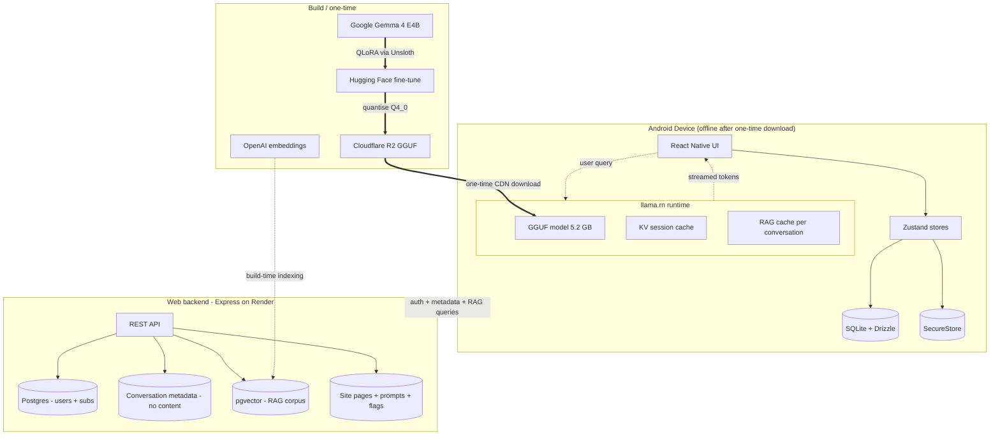

# CulinAIre Mobile

A proof-of-concept Android app where a fine-tuned 4B language model runs **fully on-device** to power a culinary AI agent — no cloud calls during inference, no conversation data leaving the phone, no internet required after the first model download. RAG retrieval is server-side (vector + keyword fallback) but the inference itself is local.

The model is **Antoine**: a culinary intelligence persona fine-tuned on Google Gemma 4 E4B (4 billion parameters), quantised to Q4_0, and run via [`llama.rn`](https://github.com/mybigday/llama.rn) inside a React Native app.

This README documents the architecture, the engineering decisions, the failures, and the performance numbers measured on real hardware (Moto G86 Power, Mediatek Dimensity 7300, CPU-only). I have not seen this specific combination — fine-tuned 4B + on-device inference + RAG + production app — published anywhere. If you are building something similar, this is the map I wish I had.

## Architecture at a glance



Legend: solid arrows = data flow at runtime. Dashed = in-device async or build-time-only. Thick arrows = one-time / build-time pipeline.

**The boundary that matters:** the only thing that crosses from the device to the backend at inference time is the user's raw query string (for RAG retrieval). The model's response, multi-turn history, image attachments, and KV cache state never leave the phone. The backend stores conversation **metadata** (id, timestamps, message count) for cross-device awareness — never message text. See [Privacy](#privacy) below for the full invariant.

**The reusable pattern:** any on-device LLM agent that wants RAG context can copy the conversation-level RAG cache + KV session save approach. Both are documented in detail in [Patterns worth extracting](#patterns-worth-extracting) — they're the difference between a 70-second cold boot and a 1.94-second turn 2.

## The stack

| Layer             | Technology                                                                              |
| ----------------- | --------------------------------------------------------------------------------------- |
| Base model        | [Google Gemma 4 E4B](https://huggingface.co/google/gemma-3n-E4B-it)                     |
| Fine-tuning       | QLoRA rank 16, [Unsloth](https://github.com/unslothai/unsloth), A100 Colab              |
| Training data     | 487 culinary instruction-response pairs (curated)                                       |
| Quantisation      | Q4_0 (NEON-optimised path) via llama.cpp                                                |
| Mobile runtime    | [`llama.rn`](https://github.com/mybigday/llama.rn) 0.12.0-rc.5                          |
| Mobile framework  | React Native (Expo SDK 54, Expo Router 6, New Architecture)                             |
| State             | Zustand + `expo-secure-store` for tokens                                                |
| On-device DB      | `expo-sqlite` + Drizzle ORM                                                             |
| RAG retrieval     | pgvector on Supabase, OpenAI text-embedding-3-small, hybrid (vector + keyword fallback) |
| Model hosting     | Cloudflare R2                                                                           |
| Backend           | Node.js / Express (separate repo)                                                       |
| Fine-tune weights | [`robangeles/culinaire-antoine-gemma4-e4b`](https://huggingface.co/robangeles)          |
| Hardware tested   | Moto G86 Power (Mediatek Dimensity 7300, 8GB RAM, Mali-G615, CPU-only inference)        |

---

## The architecture decisions that actually mattered

### 1. Conversation-level RAG caching

The standard RAG pattern re-retrieves on every turn. On cloud infrastructure that is cheap — prefill costs pennies. On a phone running a 4B model at 9 tokens per second, re-retrieval is catastrophic.

`llama.cpp` has automatic prefix-cache reuse: when consecutive turns share an identical prompt prefix (system prompt, RAG block, conversation history), only the new tokens need prefilling. The rest loads from the KV cache in milliseconds.

Re-retrieving RAG every turn breaks this. Turn 2's chunks differ from turn 1's. The prefix diverges at the first different byte. The cache invalidates. The model re-prefills hundreds of tokens that were already computed.

**Fix:** retrieve RAG chunks once on the first turn of each conversation. Cache them in Zustand. Reuse them for all subsequent turns.

**Result on the Moto G86 Power:**

| Turn   | Tokens prefilled | Prefill time |
| ------ | ---------------- | ------------ |
| Turn 1 | 780              | 87.8s        |
| Turn 2 | 17               | 1.94s        |

A **45× improvement** on turn 2. The 17 tokens represent only the new user message and turn markers — everything else loads from cache.

This pattern is well-understood in cloud inference. It is almost completely undocumented for on-device agents. The economics flip: cloud can afford to re-retrieve, phones cannot.

### 2. KV session save/load across launches

`llama.rn` exposes `saveSession` / `loadSession`. After the first cold prefill, the KV state for the system-prompt slice is written to disk. On subsequent app launches, `loadSession` restores it.

| Launch type       | Turn 1 prefill |
| ----------------- | -------------- |
| Cold (first ever) | 70.3s          |
| Warm (subsequent) | 34.6s          |

The disk read takes 23ms. The prefill it replaces takes ~37 seconds. Half the cold-boot time, automatically, on every launch after the first.

### 3. Prompt token budget is infrastructure

Every token in the system prompt costs ~110ms of prefill time at 9 tok/s. This forces a discipline cloud deployments do not need:

| Prompt version | Tokens | Cold boot |
| -------------- | ------ | --------- |
| v6             | 412    | 44.7s     |
| v7             | 736    | 81.6s     |
| v8             | 786    | 87.9s     |
| v9 (trimmed)   | 642    | 70.3s     |

Going from v6 to v8 added 374 tokens — that is **41 extra seconds of cold boot from prompt bloat alone.** Every word in a system prompt has a measurable latency cost on-device. The system prompt is infrastructure, not copy. Treat it like compiled code: every byte needs a reason to exist.

### 4. Skip RAG for image-only sends

When a user sent a photo with no text, the app was querying the knowledge base anyway using a generic default message. Retrieval returned random culinary chunks unrelated to the image, added ~250 tokens to the prefill, and biased Antoine toward irrelevant culinary topics.

**Fix:** skip RAG entirely when the user sends no text alongside an image. Vision provides the context. RAG competes with it. Three lines of code; real performance and accuracy improvement.

### 5. Q4_0 over Q4_K_M on ARM CPU

Q4_K_M is generally recommended for quality. On ARM64 CPU-only inference, Q4_0 is faster because it uses the NEON-optimised matmul path in `llama.cpp`. The quality difference on a fine-tuned domain model is negligible. The speed difference is measurable.

This is hardware-specific. It does not apply on GPU-accelerated paths where Q4_K_M's quality advantage matters more.

---

## The vision pipeline (built, parked on hardware)

Gemma 4 E4B is multimodal — the mmproj file (multimodal projection layer) converts images into token embeddings the language model can process. Getting vision working required fixing three things:

1. **`initMultimodal` was never called.** The mmproj field existed in the init options but was unused; every image-attached send processed as text-only. The fix came from reading [`alichherawalla/off-grid-mobile-ai`](https://github.com/alichherawalla/off-grid-mobile-ai)'s production implementation.
2. **Wrong API surface.** Switched from the legacy `media_paths` parameter to the modern `llama.rn` idiom: OpenAI-style content parts with `image_url` blocks.
3. **Full-resolution images.** Phone cameras produce 4032×3024 photos; the Gemma vision encoder tiles at 224px. Resize to 1024px max at picker time via `expo-image-manipulator`.

### The hardware ceiling on vision

After fixing the pipeline, vision inference on the G86:

| Metric                          | Value  |
| ------------------------------- | ------ |
| Vision tokens (image embedding) | ~290   |
| Total prefill tokens            | 932    |
| Prefill time                    | 123.9s |
| Total time before first token   | ~124s  |

The mmproj projector runs CPU-only. No GPU offload available — Vulkan is not in the `llama.rn` 0.12.0-rc.5 prebuilt JNI for Android, and the Mali-G615 Vulkan driver on Mediatek hardware produces slower-than-CPU performance even when Vulkan is available. **Two minutes before the first token appears is not shippable for a working kitchen.** This is a hardware constraint, not a software one. Vision is parked until Vulkan lands in the prebuilt JNI; off-grid reports ~7s vision inference on flagship Snapdragon 8-series hardware.

### What did work for vision accuracy

- **Temperature is the lever, not mmproj quantisation.** At temp 0.7 the model fills perceptual uncertainty with confident fabrications from the food-biased persona prior. At temp 0.4 it commits more carefully and stays closer to what is visible. Pistachios in a bowl went from "cardamom pods" to "fresh pistachios" with a single temperature change.
- **mmproj quantisation is harder than it looks.** Quantising the BF16 mmproj to Q8_0 via `llama-quantize` fails on the audio encoder's `conv1d` tensors (ncols=3, not divisible by the required block size). The pre-built Q8_0 mmproj loads correctly but produces worse accuracy because Q8_0 is lower precision than BF16, not higher. Precision relationship: BF16 (16 bits) > Q8_0 (8 bits). More bits at the projector→backbone interface produces better embedding fidelity.

---

## The numbers that matter

Measured on Moto G86 Power (Mediatek Dimensity 7300, CPU-only):

| Metric                                 | Value        |
| -------------------------------------- | ------------ |
| Hardware prefill ceiling               | ~9 tok/s     |
| Hardware decode ceiling                | ~4 tok/s     |
| Cold boot turn 1 (first ever launch)   | 70.3s        |
| Warm boot turn 1 (subsequent launches) | 34.6s        |
| Turn 2 prefill (cache hit)             | 1.94s        |
| KV session disk load vs prefill        | 23ms vs ~37s |
| Vision prefill                         | 123.9s       |

---

## What I would do differently

- **Test on flagship hardware earlier.** Every optimisation was developed on a mid-range phone. The hardware ceiling became clear only after exhausting every software lever. Testing on a Snapdragon 8-series device from the start would have revealed the vision latency problem before weeks of pipeline work.
- **Measure before optimising.** The original assumption was that every turn was slow. Measurement showed turn 1 was the bottleneck, turn 2 was fast. That finding changed the entire architecture.
- **Treat prompts as code.** On cloud, prompts are cheap. On-device, every token is latency.

---

## The shared Claude Code context pattern

Building this required two parallel Claude Code sessions — one for the mobile app, one for the web backend. They needed to communicate without manual copy-paste of context.

The solution: a shared markdown folder at a fixed path on disk, mounted as context in both `CLAUDE.md` files.

```
cc-culinaire-shared-context/
  CLAUDE.md          — instructions for both sessions
  api-contracts.md   — agreed API shapes
  db-schema.md       — shared database schema
  decisions.md       — architectural decisions log
  mobile-needs.md    — what mobile needs from the server
  web-needs.md       — what the server needs from mobile
  model-config.md    — model filenames, URLs, SHA256s
```

Both sessions read from this folder at the start of every task. SessionStart hooks (one per repo) surface changes to the OTHER side's `*-needs.md` only when modified since the last session — closes the cross-project visibility gap with no manual handoff. I have not seen this pattern documented anywhere for parallel Claude Code sessions; it costs nothing to set up.

---

## Local development

### Prerequisites

- Node.js 20+ and `pnpm`
- Android Studio with SDK + JDK 17 (Android Studio's bundled JBR works)
- `ANDROID_HOME` and `JAVA_HOME` set in your user env vars
- A real Android device (Moto G86 Power is the primary test device). Emulators won't exercise the inference path correctly.

### First-time setup

```bash
pnpm install
adb devices                    # confirms your phone is detected
adb reverse tcp:8081 tcp:8081  # forwards localhost:8081 over USB
```

### Running the app

Use **two terminal windows side-by-side**:

**Window 1 (Metro — leave running):**

```bash
pnpm start --dev-client
```

**Window 2 (everything else — adb, builds, git):**

```bash
pnpm android   # first build ~5-10 min, subsequent ~30s
```

Once installed on the phone, future code changes hot-reload — just press `r` in the Metro window. APK rebuild only needed when native deps change.

### Verification

```bash
pnpm tsc            # TypeScript check (must be 0 errors)
pnpm lint           # ESLint check (must be 0 errors)
pnpm test           # Jest unit + integration suite (173 tests)
pnpm db:generate    # regenerate Drizzle migrations after schema.ts edits
```

CI runs the same `lint / tsc / test` gates on every PR via `.github/workflows/ci.yml`.

---

## Privacy

Conversation content **never** leaves the device. Antoine runs locally via `llama.rn`. Stored on-device in SQLite via Drizzle. The backend stores only metadata (conversation IDs, timestamps, message counts) — never message text.

The single privacy boundary crossed by RAG: the user's query text leaves the device for retrieval. The model's response, multi-turn history, and image attachments never do. Server logs userId, latency, chunkCount, and search mode — not the query itself. Full invariant in [`wiki/concepts/privacy-invariant.md`](wiki/concepts/privacy-invariant.md).

A consequence of device-local storage: switching phones means a fresh chat history. Zero-knowledge encrypted backup is planned and will let users carry history across devices without weakening the privacy posture.

---

## Project layout

```
app/                    Expo Router screens (file-based routing)
  (welcome)/            Welcome carousel
  (auth)/               Login (email/pw + Google + MFA + reset)
  (onboarding)/         Antoine model download intro
  (food-safety)/        Food-safety acknowledgement gate
  (legal)/              Terms + Privacy (markdown rendered from server)
  (tabs)/chat.tsx       Chat with Antoine
  (tabs)/settings.tsx   Account, model card, sign out

src/
  components/{ui,welcome,auth,onboarding,chat,settings,legal}/
                        Reusable primitives + per-screen components
  hooks/                Hooks orchestrating services + stores
  services/             apiClient, ragService, inferenceService, etc.
  store/                Zustand stores
  db/                   Drizzle schema + queries + migrations
  constants/            theme.ts, config.ts, antoine.ts
  types/                Shared TypeScript types
  __tests__/            Unit + integration tests (173 / 27 suites)

plugins/                Expo Config Plugins (background download, etc.)
assets/brand/           Brand mark PNGs
docs/                   Architecture + design system docs
wiki/                   Living knowledge base (entities, concepts, decisions, log)
```

See [CLAUDE.md](CLAUDE.md) for the full project contract: folder structure, separation-of-concerns rules, database standards, privacy rules, git workflow, testing standards. See [wiki/synthesis/in-flight.md](wiki/synthesis/in-flight.md) for current status.

---

## Patterns worth extracting

Three pieces of this codebase generalise beyond the culinary domain and may be worth open-sourcing as standalone libraries:

1. **Conversation-level RAG cache** — three files, ~50 lines, applicable to any on-device LLM with retrieval.
2. **KV session save integration** — the `loadSession` boot flow + invalidation tied to system-prompt hash.
3. **Shared Claude Code context pattern** — the cross-repo `*-needs.md` files + SessionStart hooks for parallel coding sessions.

Open an issue if you want any of these spun out.

---

## Contributing

Contributions welcome. Workflow defined in [CLAUDE.md § Git Workflow](CLAUDE.md):

- Trunk-based development (`main` is the trunk)
- Small changes (config, docs, < 3 files) commit directly to `main`
- Non-trivial changes use short-lived feature branches with squash-merge PRs
- Pre-commit hooks run lint + format on staged files
- CI gates every PR (`lint / tsc / test`)

---

## License

The source code in this repository is **MIT** — see [LICENSE.MD](LICENSE.MD). That covers everything tracked under this repo: the React Native / Expo app, the Kotlin native modules under `plugins/`, the system prompts under `prompts/`, the wiki and docs, and the design tokens / theme code.

The MIT license **does NOT extend** to artifacts published or hosted elsewhere that this app loads at runtime or builds on top of. Each is governed by its own terms:

| Artifact                                                                                                               | License / terms                                                                                     | Where it lives                                    |
| ---------------------------------------------------------------------------------------------------------------------- | --------------------------------------------------------------------------------------------------- | ------------------------------------------------- |
| **Gemma 4 E4B base model**                                                                                             | [Gemma Terms of Use](https://ai.google.dev/gemma/terms) (Google)                                    | Upstream of the fine-tune                         |
| **Antoine fine-tuned weights** (`robangeles/culinaire-antoine-gemma4-e4b`)                                             | Inherits Gemma Terms of Use as a downstream model                                                   | [Hugging Face](https://huggingface.co/robangeles) |
| **Quantised GGUF model files** served from the CDN                                                                     | Same as the fine-tune (inherits Gemma Terms)                                                        | Cloudflare R2                                     |
| **RAG corpus** (curated culinary content + embeddings)                                                                 | Source-material copyrights retained by their respective publishers; not redistributed by this repo  | Server-side pgvector index                        |
| **Brand marks** (`assets/brand/ck-logo*.png`, the "CulinAIre" / "Antoine" names, the Caveat-script "Kitchen" wordmark) | Trademark — all rights reserved; not licensed under MIT                                             | This repo's `assets/brand/`                       |
| **Third-party npm dependencies**                                                                                       | Each package's own license; see `pnpm-lock.yaml` and per-package `LICENSE` files in `node_modules/` | Resolved at install                               |

If you fork this repo for your own on-device LLM project: the code patterns are yours to use under MIT. The model weights, RAG corpus, brand marks, and any specific culinary content authored for Antoine are not — bring your own.

Built on top of [`llama.cpp`](https://github.com/ggerganov/llama.cpp), [`llama.rn`](https://github.com/mybigday/llama.rn), [Expo](https://expo.dev/), [Drizzle ORM](https://orm.drizzle.team/), [Zustand](https://zustand-demo.pmnd.rs/), and [Unsloth](https://github.com/unslothai/unsloth). Vision pipeline pattern adapted from [`alichherawalla/off-grid-mobile-ai`](https://github.com/alichherawalla/off-grid-mobile-ai).
